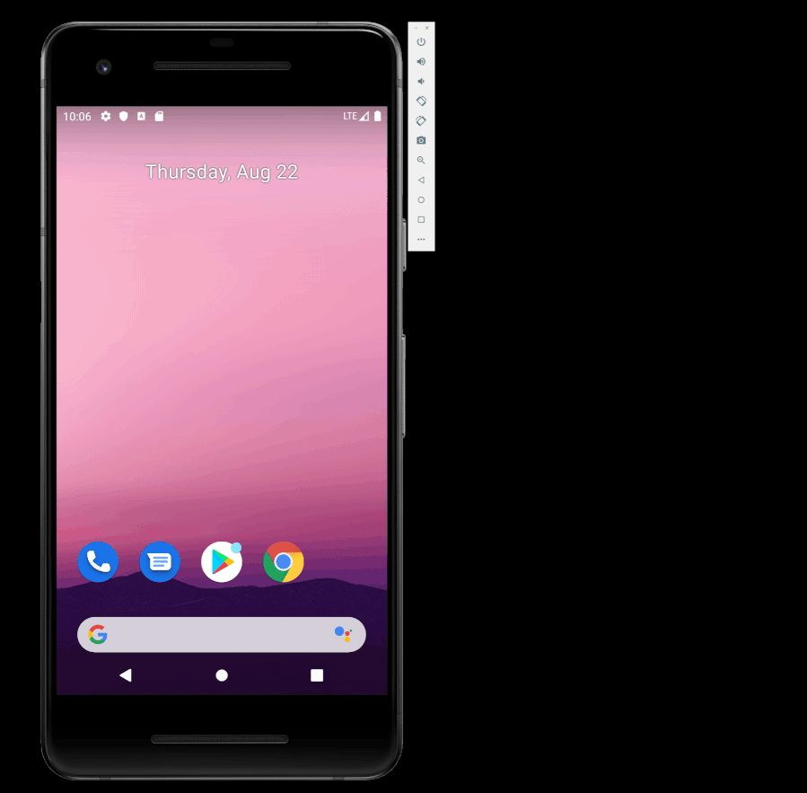

# ColorMyViews

## Description

Android app that uses ConstraintLayout to implement a responsive design.

## Features

The following functionality is complete:

* [x] Implement a Responsive UI with ConstraintLayout.
* [x] Use adaptable constraints and relative positioning to set placement of TextViews.
* [x] Set placement of labels using chaining.
* [x] Align buttons using baseline constraints.

## Demo

## Credits

Peter Akala

## License

See the [LICENSE](LICENSE.md) file for license rights and limitations (Apache License 2.0).
